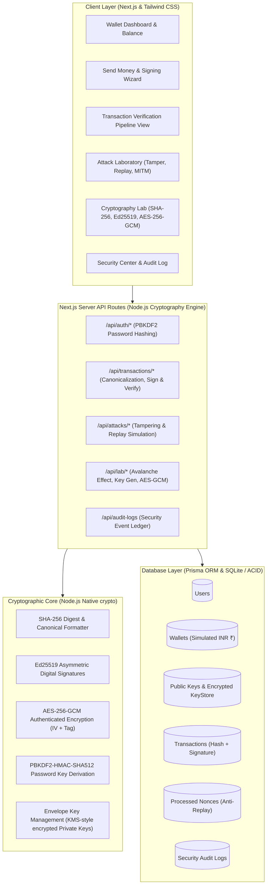
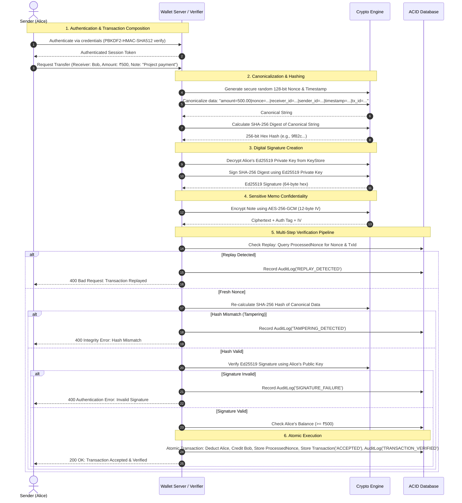

# Architecture & Design Specification: Cryptographic Digital Wallet

**Project Title:** Cryptographic Digital Wallet — Secure Transaction Authentication and Integrity Verification System  
**Subject:** Cryptography & Network Security (CNS) Mini-Project  
**Target Degree:** B.E. Computer Science and Engineering (Cyber Security)  
**Academic Year:** 2024–2025 / 2025–2026  

---

## 1. System Architecture



---

## 2. Database Schema (Prisma)

```prisma
datasource db {
  provider = "sqlite"
  url      = env("DATABASE_URL")
}

generator client {
  provider = "prisma-client-js"
}

model User {
  id           String        @id @default(uuid())
  name         String
  email        String        @unique
  passwordHash String
  passwordSalt String
  createdAt    DateTime      @default(now())
  updatedAt    DateTime      @updatedAt
  wallet       Wallet?
  publicKeys   PublicKey[]
  keyStore     KeyStore?
  sentTxs      Transaction[] @relation("Sender")
  receivedTxs  Transaction[] @relation("Receiver")
  auditLogs    AuditLog[]
}

model Wallet {
  id        String   @id @default(uuid())
  userId    String   @unique
  user      User     @relation(fields: [userId], references: [id], onDelete: Cascade)
  balance   Float    @default(10000.0)
  currency  String   @default("INR")
  createdAt DateTime @default(now())
  updatedAt DateTime @updatedAt
}

model PublicKey {
  id          String    @id @default(uuid())
  userId      String
  user        User      @relation(fields: [userId], references: [id], onDelete: Cascade)
  algorithm   String    @default("Ed25519")
  publicKeyPem String
  fingerprint String
  isRevoked   Boolean   @default(false)
  createdAt   DateTime  @default(now())
  revokedAt   DateTime?
}

model KeyStore {
  id                 String   @id @default(uuid())
  userId             String   @unique
  user               User     @relation(fields: [userId], references: [id], onDelete: Cascade)
  encryptedPrivateKey String
  iv                 String
  authTag            String
  createdAt          DateTime @default(now())
}

model Transaction {
  id                 String   @id @default(uuid())
  txId               String   @unique
  senderId           String
  sender             User     @relation("Sender", fields: [senderId], references: [id])
  receiverId         String
  receiver           User     @relation("Receiver", fields: [receiverId], references: [id])
  amount             Float
  timestamp          String
  nonce              String
  canonicalPayload   String
  transactionHash    String
  signature          String
  signatureAlgorithm String   @default("Ed25519")
  encryptedNote      String?
  encryptedNoteIv    String?
  encryptedNoteTag   String?
  status             String   // ACCEPTED, REJECTED, TAMPERED, REPLAY_ATTEMPT
  statusReason       String
  createdAt          DateTime @default(now())
}

model ProcessedNonce {
  id        String   @id @default(uuid())
  nonce     String   @unique
  txId      String
  createdAt DateTime @default(now())
}

model AuditLog {
  id        String   @id @default(uuid())
  userId    String?
  user      User?    @relation(fields: [userId], references: [id], onDelete: SetNull)
  eventType String   // LOGIN_SUCCESS, TRANSACTION_VERIFIED, TAMPERING_DETECTED, etc.
  details   String
  createdAt DateTime @default(now())
}
```

---

## 3. Cryptographic Protocol Flow



---

## 4. API Design

| Method | Endpoint | Description |
|---|---|---|
| `POST` | `/api/auth/register` | Register new user, PBKDF2 hash, generate Ed25519 keypair, init ₹10,000 balance |
| `POST` | `/api/auth/login` | Authenticate with email/password, issue HTTP-only signed session cookie |
| `POST` | `/api/auth/logout` | Terminate active user session |
| `GET`  | `/api/auth/me` | Fetch active user profile, public key fingerprint, balance |
| `GET`  | `/api/wallet` | Fetch current wallet balance and security status |
| `GET`  | `/api/users` | List eligible transfer recipients (Alice, Bob, Charlie) |
| `POST` | `/api/transactions/preview` | Generate live preview: canonical representation, SHA-256 hash, signature preview |
| `POST` | `/api/transactions/send` | Execute verified transaction pipeline atomically |
| `GET`  | `/api/transactions` | Retrieve all historical transactions with filtering |
| `GET`  | `/api/transactions/[id]` | Inspect complete cryptographic verification breakdown of a specific transaction |
| `POST` | `/api/transactions/verify` | Re-run cryptographic verification on demand for any transaction record |
| `POST` | `/api/attacks/tamper` | Attack Lab: Mutate fields after signing, execute pipeline, observe signature & hash failure |
| `POST` | `/api/attacks/replay` | Attack Lab: Re-submit recorded transaction, observe nonce rejection |
| `POST` | `/api/lab/hash` | Crypto Lab: SHA-256 digest + Avalanche effect bit comparison |
| `POST` | `/api/lab/sign` | Crypto Lab: Ed25519 keygen, signing, and verification |
| `POST` | `/api/lab/aes` | Crypto Lab: AES-256-GCM authenticated encryption, decryption, and bit-flip tamper test |
| `GET`  | `/api/audit-logs` | Retrieve real-time security audit events |
| `POST` | `/api/demo/reset` | Seed/Reset demo users (Alice ₹10,000, Bob ₹7,500, Charlie ₹5,000) for viva |

---

## 5. Security & Cryptographic Distinctions

1. **Confidentiality:** Guaranteed via **AES-256-GCM** (symmetric authenticated encryption). Sensitive transaction memos are encrypted with an authenticated tag to ensure both secrecy and authenticity.
2. **Integrity:** Guaranteed via **SHA-256** cryptographic hashing. Any bit modification in the canonical transaction string changes the digest (avalanche effect).
3. **Authenticity & Non-Repudiation:** Guaranteed via **Ed25519** digital signatures. Only Alice's private key could generate a valid signature over the transaction hash; Bob and the system verify this using Alice's public key.
4. **Replay Protection (Freshness):** Guaranteed via **128-bit cryptographically secure nonces** and unique transaction IDs logged in `ProcessedNonce`. Duplicate submissions fail immediately.
5. **Atomic Consistency:** Database transactions ensure money is never created or destroyed; balance debit and credit occur together or roll back completely.
